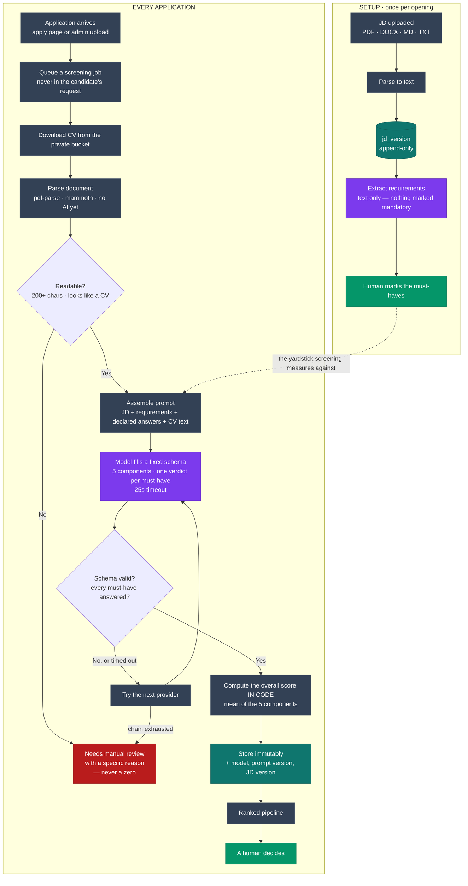

# Ziphyre — How Screening Actually Works

**For rehearsal.** The answer to "so it just throws the CV at ChatGPT?"
— no. Roughly two-thirds of this pipeline is deterministic code, and
the model is boxed in at both ends: it is given a fixed schema to fill,
and its output is validated and partly *overridden* before anything is
saved.

**The one-sentence version:** parse the document to text, hand the
model the JD, the requirements and that text, make it fill a rigid
schema, validate the schema, compute the score ourselves, and store it
with the exact model and prompt version that produced it.

---

## The whole path, on one page

**Purple is the only place a model is involved. Everything else is
deterministic code or a human.** Two AI touchpoints in the entire
pipeline — and neither of them produces the score or the decision.

**Reading it out loud, in three beats:**

1. **Nothing is mandatory until a person says so** — the green box in
   Setup.
2. **The model fills a form; it doesn't write the answer** — purple,
   boxed on both sides by parsing before and validation after.
3. **The score is arithmetic, and a human still decides** — the last
   two boxes are code and a person, not the model.

---

## Stage 0 — Setup, once per opening

- **JD uploaded** (PDF / DOCX / MD / TXT) → parsed to text → stored as
  an **append-only `jd_version`**. Editing a JD creates v2; v1 is never
  overwritten
- **Requirements extracted** by the model — but *text only*. It returns
  discrete, individually checkable items and splits compound bullets
  ("GST, TDS and reconciliation" → three requirements)
- **The model is explicitly forbidden from deciding what's mandatory.**
  Everything arrives as "preferred"; a human marks must-haves by hand

> **Why this matters, and it's the best story in the deck:** the real
> CA job description called Tally "mandatory" but never used that word
> for the CA qualification itself. Read either way, the shortlist
> reorders completely. That ambiguity is *why* the human step exists.

📁 `src/lib/ai/extract-requirements.ts`

---

## Stage 1 — Trigger

- An application arrives (hosted apply page, or admin CV upload)
- A **`screen_application` job** is queued — screening never runs
  inside the candidate's submit request
- Picked up by the after-response pump in seconds; cron is the backstop

📁 `src/lib/jobs/queue.ts`, `src/lib/jobs/runner.ts`

---

## Stage 2 — Parse the document (no AI at all)

Pure deterministic code. Nothing is sent to a model yet.

- **PDF** → `pdf-parse` / `pdfjs-dist`
- **DOCX** → `mammoth`
- **Legacy `.doc`** → refused outright with its own message. No
  maintained pure-JS extractor exists, so a shaky parse is worse than
  an honest refusal
- **Three guards before the model is worth paying for:**
  - under **200 characters** → "may be a scanned image"
  - no CV-like signal (no `@`, no *experience* / *education* / *skills*
    / *qualifications*) → "doesn't appear to be a CV"
  - parse throws → "damaged or empty", **and the error is logged**, so
    a parser regression can be told apart from a corrupt file
- **Any failure → `needs_manual_review` with a specific reason. Never a
  zero, never a silent low score.** A candidate is never disadvantaged
  by a file we couldn't read

📁 `src/lib/cv/extract-text.ts`

---

## Stage 3 — Assemble the prompt

Four blocks, in this order:

1. **The job description** (the exact stored `jd_version` text)
2. **The requirements**, each tagged `[MUST-HAVE]` or `[preferred]`
   **and carrying its database id**
3. **Candidate-declared answers** (location, notice period, CTC,
   experience, relocation)
4. **The extracted CV text**

Plus a **fixed system prompt**, versioned `screen-v3`. It is
**read-only in the UI** — visible so it isn't a black box, not editable
so every candidate meets the same yardstick.

📁 `src/lib/ai/screen-application.ts`

---

## Stage 4 — The model call

- **Structured output, not prose.** `generateObject` with a **Zod
  schema** — the model fills a form, it doesn't write an essay we then
  parse
- **Five components, integers 0–10:** `jdFit`, `experience`, `skills`,
  `qualification`, `location`
- **One verdict per must-have**, keyed by requirement id, each with a
  note
- **`strengths`, `gaps`, `overallRead`, `experienceDiscrepancy`**
- **25-second timeout, then fail over** to the next provider in the
  chain. Each attempt is logged with its duration

### What the prompt forbids

- **Never recommend an outcome.** "Describe fit; don't decide it"
- **Named credentials and tools need actual evidence.** Years of tax
  work does *not* imply a CA qualification; "accounting software" does
  *not* imply Tally. If it can't quote the CV, it's not met
- **When the CV is silent, mark it not met** — "never guess in the
  candidate's favour"
- **Gaps are distance from the JD** ("no evidence of X in the CV"),
  never a character judgement ("weak candidate")

📁 `src/lib/ai/run-with-fallback.ts`

---

## Stage 5 — Validate, and override the model

This is the part worth saying out loud.

- **Zod rejects anything off-schema** — wrong types, out-of-range
  scores, missing fields
- **Every must-have id must come back with a verdict.** A missing one
  **throws** rather than being treated as a pass. An omission is a
  validation failure, not an implied yes
- **A failed validation is never partially saved** — it throws, the
  fallback chain tries the next provider
- **The overall score is computed in code, not by the model.** It is
  the mean of the five components, rounded to one decimal. The model is
  never asked for it and its arithmetic is never trusted
- **`meetsAllMustHaves`** is derived in code too — every must-have
  must be met

---

## Stage 6 — Store it immutably

Written through a single `record_screening` database function:

- The five components, the computed overall, every must-have verdict
- `strengths`, `gaps`, `overallRead`, `experienceDiscrepancy`
- **`prompt_version`, `provider`, `model`, and `jd_version_id`**

> That last line is the audit trail. **Every score records the exact
> model, prompt version and JD version that produced it** — which is
> what makes two scores honestly comparable, and why model versions are
> pinned rather than `-latest` aliases.

**Screening rows have no update or delete policy.** A rescreen writes a
*new* row; the old one survives. The absence of the policy is the
enforcement.

---

## The guardrails, in one place

| Guardrail | How it's enforced |
|---|---|
| AI never decides an outcome | System prompt forbids it; no code path acts on a score |
| AI never sets must-haves | Extraction returns text only; a human marks them |
| AI never computes the score | Mean of five components, calculated in code |
| A missing must-have verdict isn't a pass | Explicit check; throws |
| Unreadable CV ≠ bad candidate | `needs_manual_review` with a specific reason |
| Scores stay comparable | Model, prompt version and JD version stored per score |
| Scores can't be quietly edited | No update/delete policy; rescreens append |

---

## Known limits — say these before you're asked

- **The same CV can score differently on two runs.** Observed: 9.0 then
  8.6 minutes apart, same model, same JD. Model non-determinism, not a
  bug — but it's why a rescreen may move a number
- **The model occasionally over-reads a CV.** One candidate was
  credited with Tally experience their CV never mentions; it survived
  two prompt revisions. Recorded as an accepted limitation rather than
  tuned away
- **It has no sense of today's date.** A CV reading "Chartered
  Accountant — ICAI, 2026" was marked unmet because the model read 2026
  as a future year
- **Text only, no vision.** A scanned image-only PDF goes to manual
  review — deliberate, since the open-weight fallback has no vision and
  a multimodal path would break when the fallback is needed most

**The honest framing:** these are exactly the failures the "screening
ranks, it never decides" guardrail exists to absorb. A wrong must-have
verdict costs a human thirty seconds of reading. It never costs a
candidate their application.

---

**Deeper reading:** `TechDecisions.md` §7 (model findings and
alternatives rejected), `docs/tech-specs/` §6 (schema and job flow),
`ProductNotes/PN-003` (why the prompt is visible but not editable).
